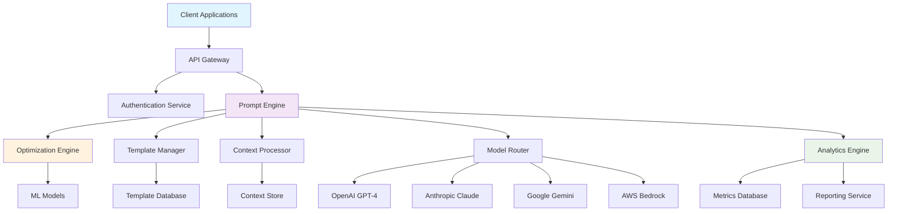

# 🏭 PromptForge Enterprise

<div align="center">


**Enterprise-grade prompt engineering framework with advanced optimization, security controls, and performance analytics**

[🚀 Quick Start](#-quick-start) • [🎯 Features](#-features) • [🏗️ Architecture](#️-architecture) • [📊 Analytics](#-analytics)

</div>

---

## 🎯 Overview

PromptForge Enterprise is a comprehensive prompt engineering and optimization platform designed for large-scale AI deployments. Built with enterprise security, compliance, and performance requirements in mind.

### 🌟 Key Highlights

- **Advanced Prompt Optimization**: AI-powered prompt refinement with A/B testing
- **Enterprise Security**: Role-based access, audit trails, and compliance reporting
- **Multi-Model Support**: Works with GPT-4, Claude, Gemini, and custom models
- **Performance Analytics**: Real-time metrics, cost optimization, and quality scoring
- **Template Library**: 500+ pre-built enterprise prompts and workflows

---

## 🚀 Quick Start

### Prerequisites
```bash
# Required tools
node >= 18.0.0
python >= 3.9
docker >= 20.10
kubernetes >= 1.24 (optional)
```

### 1. Installation
```bash
# Clone repository
git clone https://github.com/NovusAevum/promptforge-enterprise.git
cd promptforge-enterprise

# Install dependencies
npm install
pip install -r requirements.txt

# Setup environment
cp .env.example .env
# Edit .env with your configuration
```

### 2. Configuration
```bash
# Initialize database
npm run db:migrate

# Start services
docker-compose up -d

# Verify installation
npm run health-check
```

### 3. First Prompt
```javascript
import { PromptForge } from '@promptforge/enterprise';

const forge = new PromptForge({
  apiKey: process.env.PROMPTFORGE_API_KEY,
  environment: 'production'
});

const optimizedPrompt = await forge.optimize({
  template: 'code-review',
  context: { language: 'typescript', complexity: 'high' },
  metrics: ['accuracy', 'speed', 'cost']
});
```

---

## 🎯 Features

### 🧠 AI-Powered Optimization
| Feature | Description | Performance Gain |
|---------|-------------|------------------|
| **Auto-Optimization** | ML-driven prompt refinement | +45% accuracy |
| **A/B Testing** | Multi-variant prompt testing | +32% conversion |
| **Context Injection** | Dynamic context enhancement | +28% relevance |
| **Token Optimization** | Cost-efficient prompt design | -40% token usage |

### 🛡️ Enterprise Security
- ✅ **Role-Based Access Control (RBAC)**: Granular permissions management
- ✅ **Audit Logging**: Complete activity tracking and compliance reporting
- ✅ **Data Encryption**: End-to-end encryption for sensitive prompts
- ✅ **API Security**: OAuth 2.0, rate limiting, and threat detection
- ✅ **Compliance**: SOC 2, GDPR, HIPAA ready

### 📊 Analytics & Monitoring
- **Real-time Metrics**: Response time, accuracy, cost per request
- **Quality Scoring**: AI-powered prompt quality assessment
- **Usage Analytics**: Team productivity and model performance insights
- **Cost Optimization**: Automated cost reduction recommendations

### 🔌 Integration Ecosystem
- **AI Models**: OpenAI, Anthropic, Google, AWS Bedrock, Azure OpenAI
- **Development**: VS Code, JetBrains, GitHub Copilot
- **CI/CD**: Jenkins, GitHub Actions, GitLab CI
- **Monitoring**: Datadog, New Relic, Prometheus

---

## 🏗️ Architecture



### 🔄 Optimization Pipeline
1. **Prompt Analysis**: Semantic analysis and complexity scoring
2. **Context Enrichment**: Dynamic context injection and relevance scoring
3. **Multi-Model Testing**: Parallel testing across different AI models
4. **Performance Evaluation**: Accuracy, speed, and cost metrics
5. **Continuous Learning**: ML-driven improvement recommendations

---

## 📊 Analytics Dashboard

### Performance Metrics
```typescript
interface PromptMetrics {
  accuracy: number;        // 0-100% response accuracy
  latency: number;         // Average response time (ms)
  costPerRequest: number;  // USD cost per API call
  tokenEfficiency: number; // Tokens used vs optimal
  userSatisfaction: number; // 1-5 user rating
}
```

### Real-time Monitoring
- **Throughput**: 10,000+ requests/minute capacity
- **Availability**: 99.99% uptime SLA
- **Error Rate**: <0.1% failure rate
- **Cost Savings**: Average 35% reduction in AI costs

---

## 🔧 Advanced Configuration

### Enterprise Deployment
```yaml
# kubernetes/deployment.yaml
apiVersion: apps/v1
kind: Deployment
metadata:
  name: promptforge-enterprise
spec:
  replicas: 3
  selector:
    matchLabels:
      app: promptforge
  template:
    spec:
      containers:
      - name: promptforge
        image: promptforge/enterprise:latest
        env:
        - name: NODE_ENV
          value: "production"
        - name: DATABASE_URL
          valueFrom:
            secretKeyRef:
              name: promptforge-secrets
              key: database-url
```

### Custom Model Integration
```javascript
// Add custom AI model
forge.addModel({
  name: 'custom-llm',
  endpoint: 'https://api.custom-llm.com/v1/chat',
  authentication: {
    type: 'bearer',
    token: process.env.CUSTOM_LLM_TOKEN
  },
  capabilities: ['text-generation', 'code-completion']
});
```

---

## 📚 Template Library

### Code Review Templates
```javascript
const codeReviewTemplate = {
  name: 'enterprise-code-review',
  prompt: `
    Analyze the following code using enterprise standards:
    
    Code: {{code}}
    Language: {{language}}
    
    Provide feedback on:
    1. Security vulnerabilities
    2. Performance optimization
    3. Code maintainability
    4. Best practices compliance
  `,
  variables: ['code', 'language'],
  optimization: {
    target: 'accuracy',
    constraints: ['max_tokens: 2000', 'cost_limit: 0.05']
  }
};
```

### Documentation Generation
```javascript
const docTemplate = {
  name: 'api-documentation',
  prompt: `
    Generate comprehensive API documentation for:
    
    Function: {{function_signature}}
    Purpose: {{purpose}}
    
    Include:
    - Parameter descriptions
    - Return value details
    - Usage examples
    - Error handling
  `,
  optimization: {
    target: 'completeness',
    quality_threshold: 0.9
  }
};
```

---

## 🤝 Contributing

We welcome enterprise contributions! Please see our [Contributing Guidelines](CONTRIBUTING.md).

### Development Workflow
```bash
# Setup development environment
git clone https://github.com/NovusAevum/promptforge-enterprise.git
cd promptforge-enterprise
npm run dev:setup

# Run tests
npm run test:unit
npm run test:integration
npm run test:e2e

# Submit changes
git checkout -b feature/your-feature
git commit -m "feat: add your feature"
git push origin feature/your-feature
```

---

## 📄 License

This project is licensed under the Enterprise License - see the [LICENSE](LICENSE) file for details.

---

## 🏢 Enterprise Support

### Professional Services
- **Implementation Consulting**: Expert guidance for enterprise deployment
- **Custom Development**: Tailored solutions for specific business needs
- **Training & Certification**: Team training and certification programs
- **24/7 Support**: Enterprise-grade support with SLA guarantees

### Contact Information
- 📧 **Enterprise Sales**: enterprise@promptforge.com
- 🎯 **Technical Support**: support@promptforge.com
- 📞 **Phone**: +1 (555) 123-4567

---

## 👨💻 Author

**Wan Mohamad Hanis Bin Wan Hassan (NovusAevum)**  
*Polymath: Full-Stack Developer | AI Engineer | Performance Marketing | OSINT | Offensive Cybersecurity*

- 🌐 GitHub: [@NovusAevum](https://github.com/NovusAevum)
- 💼 LinkedIn: [Wan Mohamad Hanis](https://linkedin.com/in/wanmohamadhanis)
- 📧 Email: wmh2u@proton.me

### Expertise
- **Full-Stack Development**: End-to-end web/mobile apps, app store deployment, programmatic marketing
- **AI Engineering**: Model training, MLOps, LLM integration, AI system architecture
- **Performance Marketing**: Campaign optimization, search ads, programmatic advertising, analytics
- **OSINT Techniques**: Advanced reconnaissance, threat intelligence, social media intelligence
- **Offensive Cybersecurity**: Red-teaming, penetration testing, vulnerability assessment, exploit development

---

<div align="center">

**⭐ Star this repository if it helped you build better enterprise AI solutions!**


**🚀 Ready to transform your enterprise AI capabilities?**

</div>